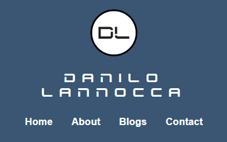
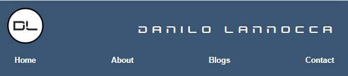
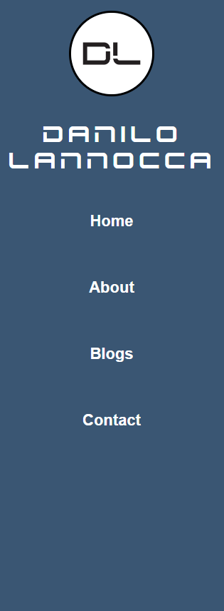
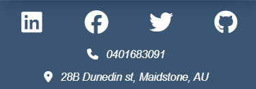
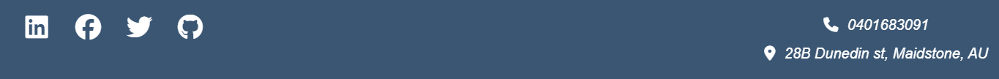
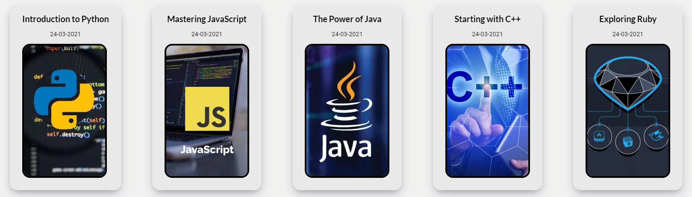
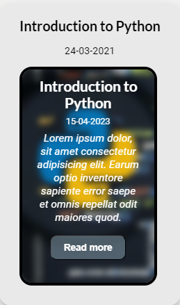

# T1A2 Portfolio - Danilo Lannocca

## Published portfolio website

[Link to my portfolio's website](https://daniloportfolio.netlify.app)

## GitHub Repository

[Link to my GitHub Repo](https://github.com/danilo90lan/Portfolio-final)

## Purpose

The purpose of my Portfolio's website is to help illustrate my skills, abilities and attitudes to prospective employers in the development industry.

## Functionality/Features

I built my own website using HTML and CSS for styling. I used Flexbox to create the layout of each page, ensuring that each component is displayed correctly on the screen. Additionally, I considered responsiveness for multiple users, creating different layouts for mobile, tablet, and desktop to optimize the user experience. 
My website is made of:

#### Header

The header includes the website's logo, the full name, and the navigation bar, which contains links to the main pages of the website, such as Home, About, Blogs, and Contact. It's placed at the top for the mobile and tablet views, but for the desktop view, I placed it on the left side to allow the main section to take up the rest of the screen.

###### Mobile view

The logo is at the top, name in the middle and the nav bar at the bottom.

###### Tablet view

The logo is at the left, name at the right and the nav bar at the bottom

###### Desktop view

For the desktop view, I used a column layout to display each element of the header, stacking them one on top of the other.

##### Footer

The footer is placed at the bottom of the page and includes essential information like the phone number, address, and social media details. The footer is consistent across all viewports, except for the desktop view where the social media icons are displayed on the left and the personal information is on the right.

###### Mobile and tablet view

###### Desktop view

#### Cards section
To create a more visually appealing layout, I displayed the main content in cards that contain images, a description of the content, and a link to the main topic.

Each card includes a hover property that reveals the card's content when the user hovers over it.

#### About